# 微醺账本

原生 HTML、CSS 和 JavaScript 实现的响应式 H5 酒局记账应用，前端无运行时依赖，数据按匿名设备标识持久化到服务端 D1，无需登录。

## 功能截图

以下截图来自本地运行的真实移动端布局，使用独立演示酒局数据。点击图片可查看原图；桌面端将记账与排行榜并排展示。

### 1. 酒局记账与操作撤销

在「记账」页查看每位酒友的待喝数量，点击成员后在下方操作区快捷加减酒、喝完一杯或编辑成员。图中全员杯量为 `1 杯 = 2 个`，点击杯子按钮会扣减 2 个待喝，同时增加已喝数量与杯数；待喝不足一杯时按钮不可用。

下方「最近记录」展示成员操作，点「撤销上一步」可撤回当前页面最近的成员操作，最多保留 30 次撤销机会，刷新后清空。

<a href="docs/screenshots/ledger.jpg">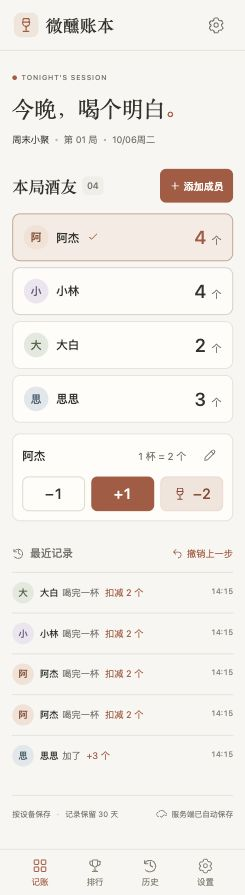</a>

### 2. 批量添加与编辑酒友

点击「添加成员」，用「再加一位」一次录入多位酒友，并分别设置初始待喝数量。昵称框也可下拉选择以前添加过的酒友，已在本局或当前其他输入行中的成员会被排除。

选中成员后点击编辑按钮，可修改昵称、头像颜色和待喝数量，也可移除成员。下图分别展示批量添加和编辑表单。

<a href="docs/screenshots/add-members.jpg">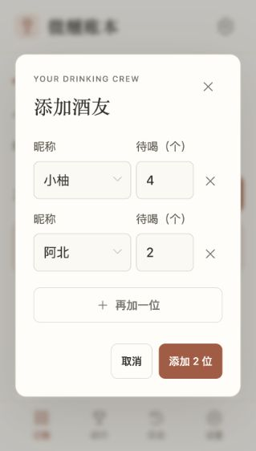</a>
<a href="docs/screenshots/edit-member.jpg">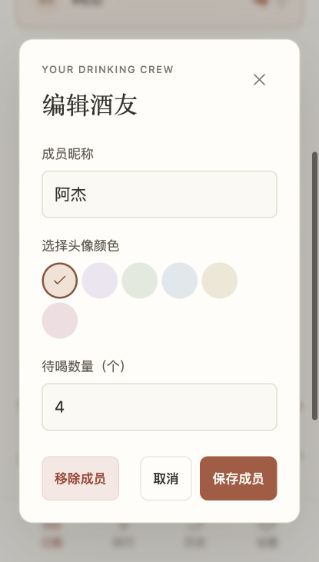</a>

### 3. 实时单局排行榜

在「排行」页按已喝「个数」降序查看本局排名，同时看到每位酒友的已喝杯数与剩余待喝。相同已喝数量并列排名：图中小林和大白都已喝 2 个，并列第 2 名。

<a href="docs/screenshots/ranking.jpg">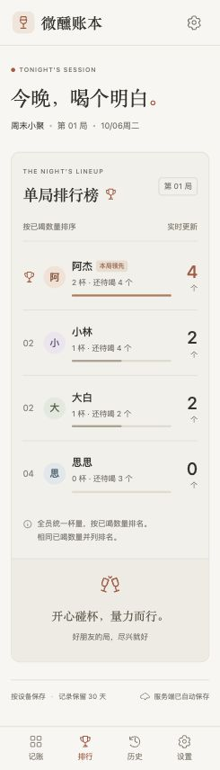</a>

### 4. 酒局设置与新开一局

在「设置」中修改酒局名称和快捷加减步长；点击「新开一局」设置新局名称与全员统一杯量，并选择是否保留本局成员。新局清空计数和操作记录，上一局自动归档；初次访问的体验酒局不归档。

<a href="docs/screenshots/settings.jpg">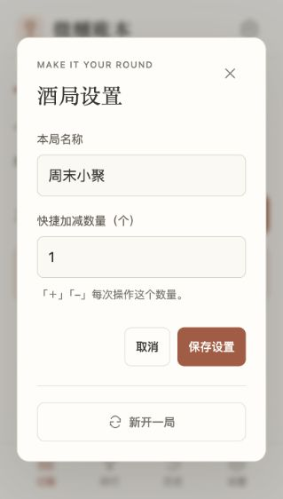</a>
<a href="docs/screenshots/new-session.jpg">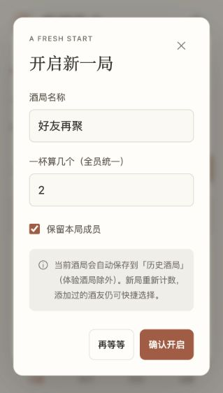</a>

### 5. 历史酒局与详情回看

在「历史」页查看已结束的酒局，列表显示局名、时间、成员数和已喝总量。点击记录可回看结束时的成员计数、排行榜及最近 80 条操作记录，历史酒局保留 30 天。

<a href="docs/screenshots/history.jpg">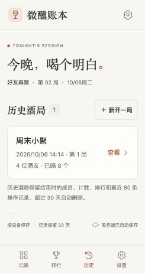</a>
<a href="docs/screenshots/history-detail.jpg">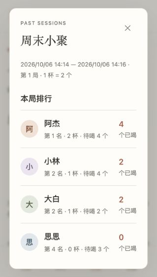</a>
<a href="docs/screenshots/history-records.jpg">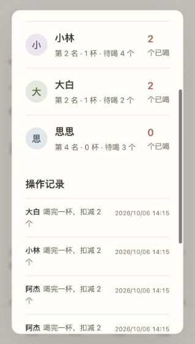</a>

### 6. 结束本局与总结分享图

正式酒局可在页面顶部点击「结束本局」，确认后立即保存结束时间和最终计数，并归档到历史。结束后的本局只读，剩余待喝原样保留，不计入已喝；刷新仍保留结束状态。新开一局可保留酒友，清零计数，不重复归档已经结束的本局。

结束后自动打开「总结分享图」，包含局名、起止时间、相聚时长、全员总计与每位酒友的最终计数，支持预览、下载 PNG 和长按保存。浏览器支持图片分享时显示「分享图片」；历史详情也可生成总结。图片在浏览器本地生成，不上传图片或生成公开链接。

<a href="docs/screenshots/finished-session.png">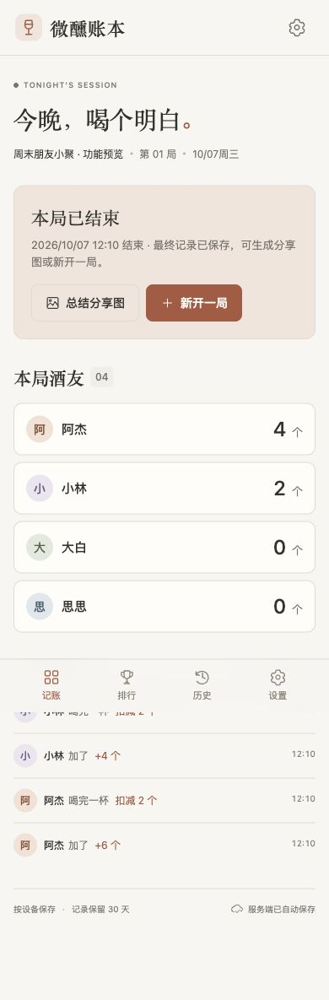</a>
<a href="docs/screenshots/session-summary.png">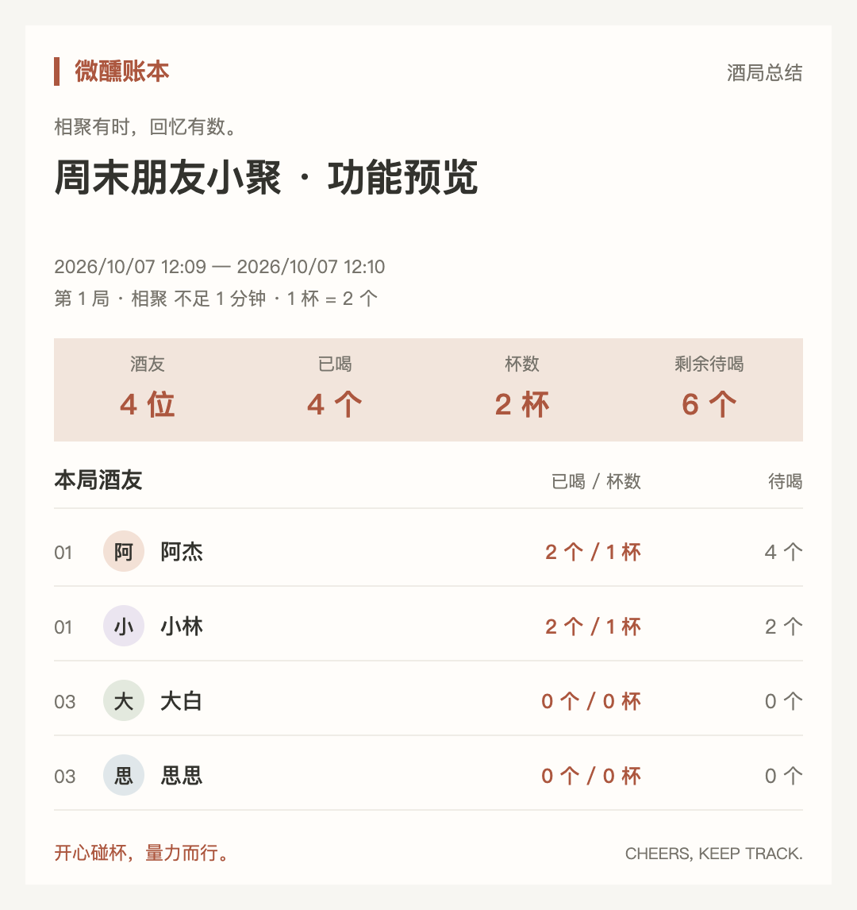</a>

## 功能

- 一次添加多位成员，分别设置昵称和初始待喝数量；支持编辑昵称、头像颜色与待喝数量，以及移除成员。
- 酒友按单行列表展示，左侧姓名，右侧待喝酒数；选中后在独立操作区加减酒、喝完一杯或编辑成员。
- 加减待喝数量；快捷加减步长可在酒局设置中调整。
- 开局时设置全员统一杯量；喝完一杯，从待喝中扣除本局杯量，同时增加已喝数量和杯数。
- 待喝数量不足一杯时禁用喝完按钮，避免出现负数。
- 单局排行榜按已喝「个数」降序排列，相同数量并列。
- 显示最近操作，支持撤销当前页面中最近 30 次成员操作。
- 新开一局清空计数与记录，可选择保留成员，并为所有成员应用新局设置的杯量。
- 支持独立结束本局，立即保存实际结束时间并归档，结束后本局计数和设置只读；新开一局前也会自动归档未结束的上一局，已经结束的本局不重复归档；体验酒局不归档。
- 结束后的本局和历史详情均可生成总结分享图，支持 PNG 下载、长按保存，以及浏览器支持时的系统图片分享。
- 记住添加过的酒友，移除或新开局后仍可选择；在每行昵称框中通过下拉菜单选择以前的酒友，排除本局成员及其他行已经选择的成员；可手动输入新酒友，并分别设置初始待喝。
- 当前酒局、历史酒局、酒友名单和快捷步长通过同源 `/api/ledger` 自动保存到服务端；成功保存后才更新页面，网络或服务异常时保留表单输入供重试。
- 浏览器只保存随机设备标识和迁移/同步标记。服务端按设备隔离记录；设备标识不进入 URL，使用 `X-Device-ID` 请求头。无需账号，也不读取登录身份。
- 同设备页面通过同步标记、重新聚焦和每分钟检查同步记录；服务端使用原子版本检查和账本代际标识，防止旧页面覆盖新数据或写回已清理的账本。
- 首次访问自动迁移原 `cheers-ledger-v2`（优先）或 `cheers-ledger-v1` 的本机记录；保存到服务端成功后清除旧本地账本并标记迁移完成。失败保留原记录，已过期的服务端账本不会重新上传旧备份。
- 保留最近 30 天：历史酒局和已结束的本局按结束时间，未结束的当前酒局按开始时间，操作按发生时间，酒友按最后添加、修改或使用时间清理。连续 30 天未保存的设备整份账本删除，读取不延长寿命。
- Worker 每小时自动清理；每次读取或写入也检查当前设备的过期数据。本地开发服务启动时及每小时执行相同清理逻辑。
初次打开为明确标记的体验酒局。在「设置」中点击「新开一局」即可开始自己的记录。
每杯与快捷加减数量支持 1–99 的整数，成员待喝和已喝分别最多 9999 个，每局最多 30 人。
旧版记录会将成员杯量统一为已有酒局设置，历史杯数、已喝数量和操作记录不重新换算。
记录按设备、浏览器及网站地址的随机标识隔离，不跨设备同步。清除本站浏览器数据会丢失设备标识，无法再访问原账本；服务端原数据按保留期限自动清理。隐私浏览关闭后通常会生成新设备标识。撤销记录在刷新后清空。
昵称在本局内不重复；编辑时也不能占用其他已保存酒友的昵称，避免合并成员身份。

## 本地运行

```sh
cd /Users/liuna/code/drinkdrink/site
npm run dev
```

访问 `http://127.0.0.1:4173/`。需要 Node.js 22.13+（内置 `node:sqlite`）；账本保存到忽略提交的 `.local-data/ledger.sqlite`，自动应用迁移。端口被占用时可使用 `PORT=4174 npm run dev`。本地与线上数据库独立。静态 HTTP 服务不支持服务端保存。

## 验证

```sh
npm test
node --check dist/app.mjs
node --check dist/device-storage.mjs
```

前端源文件直接位于 `dist/`。`persistence.mjs` 管理结束、归档与成员，`summary.mjs` 汇总最终计数并绘制 PNG 分享图，`device-storage.mjs` 仅用于读取旧备份，`server-storage.mjs` 管理设备标识、API 读写与迁移。`server/worker.mjs` 提供 API 及定时清理，`server/retention.mjs` 管理 30 天保留规则。

`npm run build` 生成 `dist/client`、`dist/server` 和部署元数据，保留已部署的 `0000` 数据库迁移，新增 `device_ledgers` 表及清理索引。`.openai/hosting.json` 绑定 D1 `DB`，Worker 配置每小时整点执行 `scheduled`。线上使用 Sites 现有公开访问权限，不需要登录。
